# SkillForge Learning Platform

SkillForge is a Java Swing learning management platform built as a desktop application using object-oriented programming principles. It simulates a complete learning environment where students, instructors, and administrators interact through role-based dashboards, course workflows, quizzes, progress tracking, certificates, and analytics.

## Project Overview

The project was designed to practice real software engineering concepts in Java, including:

- Object-oriented design
- Role-based access control
- GUI development with Java Swing
- File-based persistence using JSON
- Course and lesson management
- Quiz creation and progress tracking
- Certificate generation
- UML-based system design
- External library integration

## Main Functionalities

### Authentication and User Management

- Login system with role selection
- Student and Instructor sign-up
- Admin access
- Role-based dashboard navigation
- User data stored in JSON format

Demo accounts:

| Role | Email | Password |
|---|---|---|
| Student | student@skillforge.demo | student123 |
| Instructor | instructor@skillforge.demo | instructor123 |
| Admin | admin@skillforge.demo | admin123 |

### Student Features

- View student dashboard
- Browse approved courses
- Enroll in available courses
- View enrolled courses
- Open course details
- Track lesson progress
- Complete quizzes
- View earned certificates

### Instructor Features

- View instructor dashboard
- Create new courses
- Manage existing courses
- Add lessons
- Add quizzes
- View enrolled students
- Access course insights and analytics

### Admin Features

- View admin dashboard
- Review pending course submissions
- Approve courses
- Reject courses
- Manage platform-level course approval workflow

### Course and Learning Features

- Course creation
- Course approval status
- Lesson management
- Quiz questions and answer options
- Student enrollment tracking
- Course progress tracking
- Average quiz performance tracking

### Certificate Features

- Certificate generation after course completion
- Certificate data saved in JSON
- PDF certificate generation using Apache PDFBox

### Analytics Features

- Course insights
- Student enrollment information
- Lesson completion data
- Quiz average tracking
- Visual analytics using JFreeChart

## Technologies Used

- Java
- Java Swing
- Object-Oriented Programming
- JSON
- Apache PDFBox
- JFreeChart
- NetBeans
- Draw.io / diagrams.net
- Git and GitHub

## Project Structure

```text
skillforge-learning-platform/
│
├── src/skillforge/              Java source code
├── docs/uml-design/source/      Draw.io UML source files
├── docs/uml-design/images/      Exported UML diagram images
├── screenshots/                 Application screenshots
├── nbproject/                   NetBeans project configuration
├── lib/                         External libraries
├── users.json                   Demo user data
├── courses.json                 Demo course data
├── build.xml                    Ant build configuration
├── manifest.mf                  Manifest file
└── README.md
```

## How to Run the Project

### Recommended Method: NetBeans

1. Install Java JDK.
2. Install Apache NetBeans.
3. Clone the repository:

```bash
git clone https://github.com/Youssufathalla/skillforge-learning-platform.git
```

4. Open NetBeans.
5. Select:

```text
File > Open Project
```

6. Choose the `skillforge-learning-platform` folder.
7. Right-click the project and select:

```text
Clean and Build
```

8. Click:

```text
Run
```

The application should start from the login screen.

### Command Line Method

From the project directory:

```bash
ant clean jar
```

Then run:

```bash
java -jar dist/skillforge-learning-platform.jar
```

## Screenshots

### Login Screen

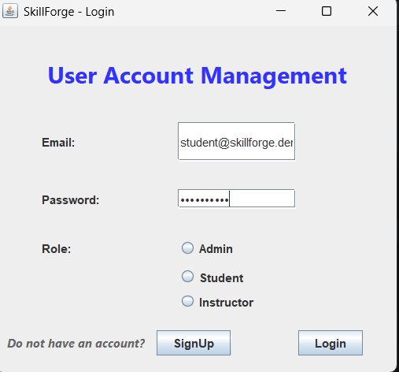

### Sign Up Screen

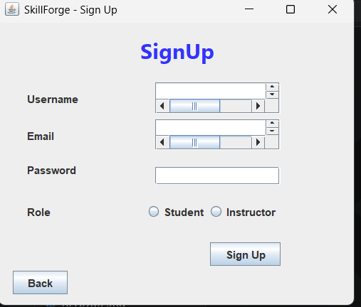

### Student Dashboard

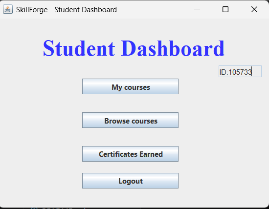

### Browse Courses

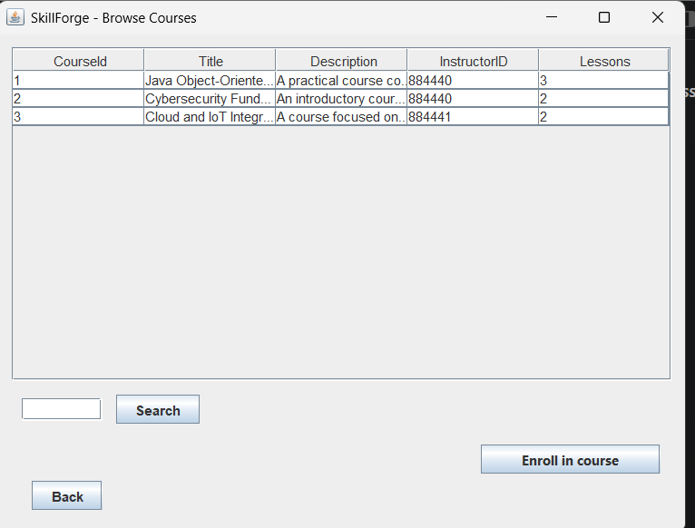

### Instructor Dashboard

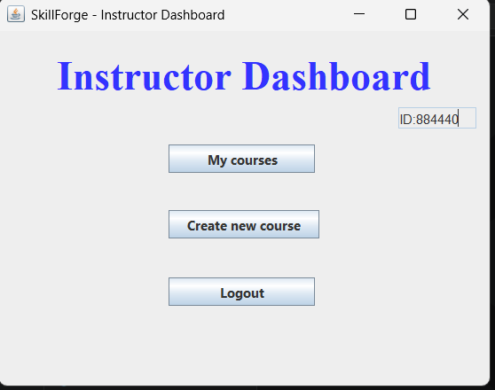

### Manage Courses

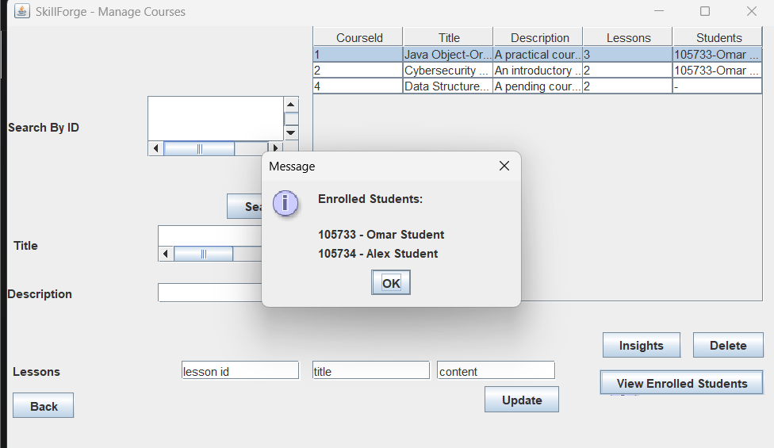

### Course Approval

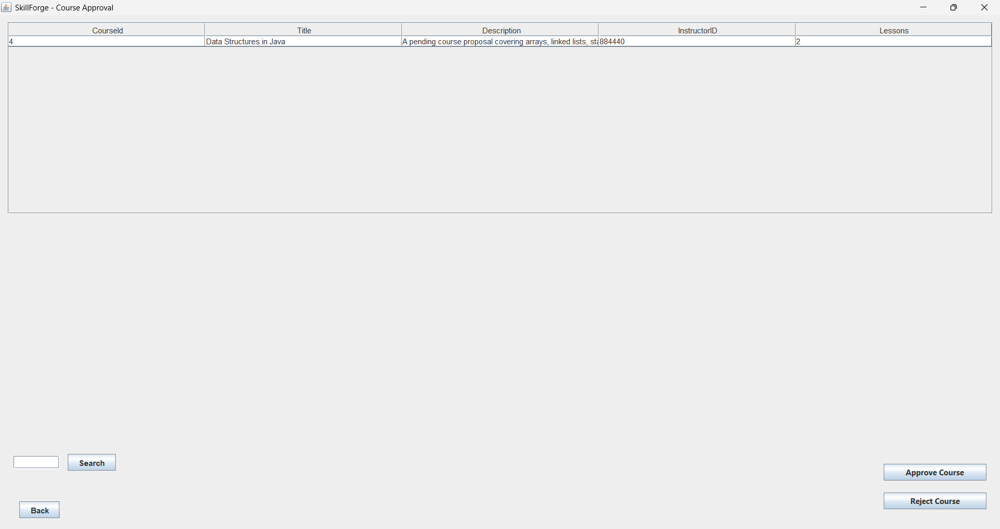

### Certificate Generation

.png>)

## UML Design

The project includes UML diagrams created during the design phase.

### Use Case Diagram

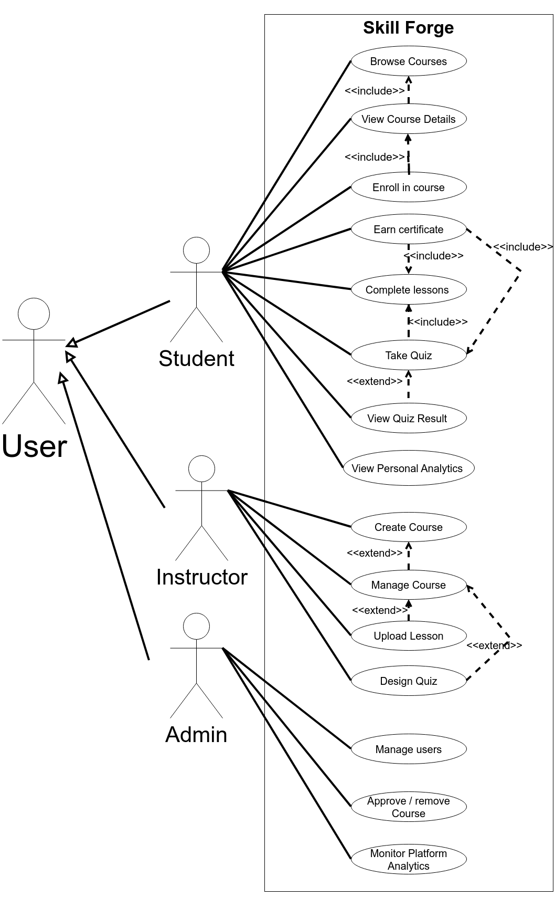

### Class Diagram

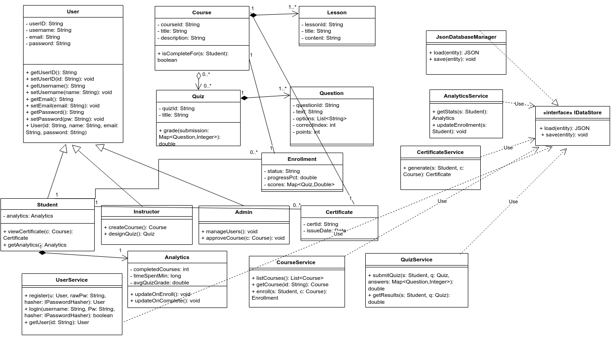

### Sequence Diagram

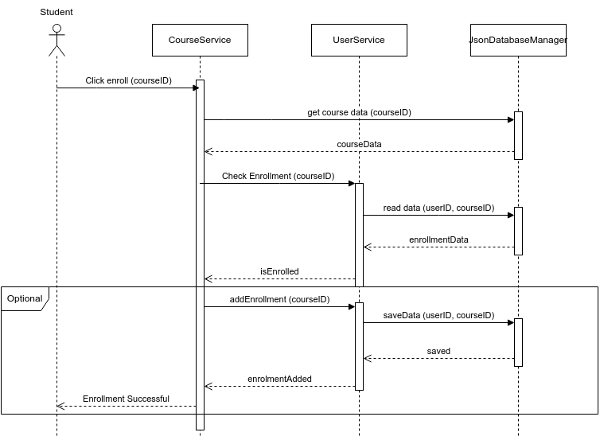

### Activity Diagram

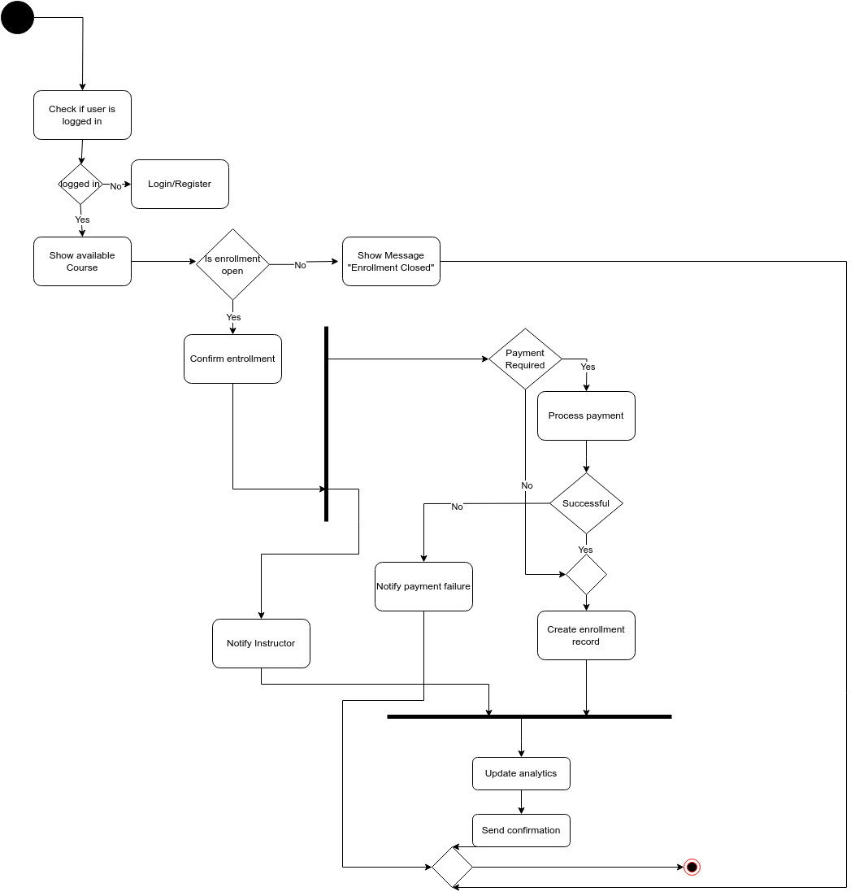

The original editable Draw.io files are available in:

```text
docs/uml-design/source/
```

## What I Learned

- Structuring a larger Java Swing project
- Applying object-oriented programming to a real application
- Building role-based systems
- Managing users, courses, lessons, quizzes, and certificates
- Working with JSON file persistence
- Integrating external Java libraries
- Creating UML diagrams for software design
- Cleaning and publishing a professional GitHub repository

## Future Improvements

- Improve the visual design of the Swing interface
- Add stronger input validation across all forms
- Store generated certificates in a dedicated output folder
- Add password hashing improvements and better authentication handling
- Replace JSON files with a database
- Add unit tests
- Improve exception handling and logging
- Package the application with an installer

## Author

Youssuf Hatem Fathalla
